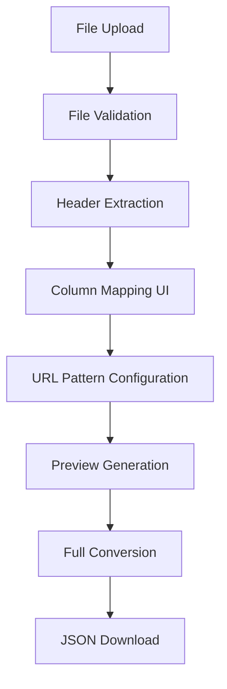

# Design Document

## Overview

The file-to-JSON converter feature will be implemented as a Next.js application with a multi-step user interface that guides users through file upload, configuration, preview, and conversion. The system leverages existing utility libraries for file parsing, URL processing, and JSON generation while providing a clean, intuitive user experience.

## Architecture

### Frontend Architecture
- **Next.js App Router**: Modern React-based routing and server components
- **Multi-step Form Interface**: Progressive disclosure of configuration options
- **Client-side File Processing**: Immediate feedback and validation
- **Real-time Preview**: Live updates as users modify configuration

### Backend Architecture
- **API Routes**: Next.js API endpoints for file processing
- **Streaming Processing**: Memory-efficient handling of large files
- **Utility Libraries**: Existing lib/ modules for core functionality
- **Error Handling**: Comprehensive validation and error reporting

### Data Flow


## Components and Interfaces

### Core Components

#### 1. FileUploadComponent
- **Purpose**: Handle file selection and initial validation
- **Props**: `onFileSelect`, `acceptedTypes`, `maxSize`
- **State**: `selectedFile`, `validationError`, `isUploading`
- **Features**:
  - Drag-and-drop interface
  - File type and size validation
  - Progress indication
  - Error display

#### 2. ColumnMappingComponent
- **Purpose**: Configure column mappings for data processing
- **Props**: `headers`, `onMappingChange`, `currentMapping`
- **State**: `columnMapping`, `validationErrors`
- **Features**:
  - Dropdown selectors for each mapping field
  - Required field validation
  - Real-time validation feedback
  - Clear mapping indicators

#### 3. URLPatternComponent
- **Purpose**: Configure URL pattern with placeholder validation
- **Props**: `pattern`, `onPatternChange`, `availableColumns`
- **State**: `urlPattern`, `placeholders`, `validationResult`
- **Features**:
  - Pattern input with syntax highlighting
  - Placeholder extraction and validation
  - Real-time pattern validation
  - Example URL generation

#### 4. PreviewComponent
- **Purpose**: Display sample conversion results
- **Props**: `previewData`, `onConfigChange`
- **State**: `sampleUrls`, `exclusionReasons`, `statistics`
- **Features**:
  - Sample URL display
  - Exclusion reason reporting
  - Statistics summary
  - Configuration adjustment options

#### 5. ConversionResultsComponent
- **Purpose**: Display final conversion results and download options
- **Props**: `conversionResult`, `onDownload`
- **State**: `processingStatus`, `downloadReady`
- **Features**:
  - Processing progress indication
  - Statistics display
  - Multiple download formats
  - Error reporting

### API Endpoints

#### POST /api/upload
- **Purpose**: Handle file upload and initial processing
- **Input**: FormData with file
- **Output**: File metadata and headers
- **Processing**:
  - File validation
  - Header extraction
  - Initial file analysis

#### POST /api/preview
- **Purpose**: Generate preview of conversion results
- **Input**: File buffer, configuration object
- **Output**: Sample URLs and statistics
- **Processing**:
  - Sample row processing
  - URL pattern application
  - Preview generation

#### POST /api/convert
- **Purpose**: Perform full file conversion
- **Input**: File buffer, complete configuration
- **Output**: Complete JSON data
- **Processing**:
  - Full file processing
  - JSON generation
  - Statistics compilation

#### GET /api/download/[id]
- **Purpose**: Download converted JSON file
- **Input**: Conversion ID
- **Output**: JSON file download
- **Processing**:
  - File retrieval
  - Format selection
  - Download preparation

## Data Models

### Configuration Object
```typescript
interface ConversionConfig {
  columnMapping: {
    link: string;
    category?: string;
    store_id?: string;
    lastmod?: string;
    [key: string]: string;
  };
  urlPattern: string;
  grouping: 'none' | 'category' | 'store_id';
  includeLastmod: boolean;
  lastmodField?: string;
  changefreq?: string;
  priority?: string;
}
```

### Preview Result
```typescript
interface PreviewResult {
  previewUrls: Array<{
    url: string;
    rowNumber: number;
  }>;
  validCount: number;
  excludedCount: number;
  excludedReasons: string[];
  totalSampled: number;
}
```

### Conversion Result
```typescript
interface ConversionResult {
  success: boolean;
  json?: {
    metadata: object;
    statistics: object;
    data: Array<object>;
  };
  error?: string;
}
```

## Error Handling

### Client-side Validation
- File type and size validation
- Required field validation
- URL pattern syntax validation
- Real-time feedback display

### Server-side Processing
- Comprehensive error catching
- Detailed error messages
- Graceful degradation
- Recovery suggestions

### Error Categories
1. **File Errors**: Invalid format, size exceeded, corrupted data
2. **Configuration Errors**: Missing mappings, invalid patterns, unresolved placeholders
3. **Processing Errors**: Memory issues, parsing failures, conversion errors
4. **System Errors**: Network issues, server errors, timeout errors

## Testing Strategy

### Unit Tests
- Utility function testing (existing lib/ modules)
- Component behavior testing
- API endpoint testing
- Error handling testing

### Integration Tests
- End-to-end conversion workflow
- File upload and processing
- Configuration validation
- Download functionality

### Performance Tests
- Large file handling
- Memory usage monitoring
- Processing time benchmarks
- Concurrent user testing

### User Acceptance Tests
- Complete user workflows
- Error scenario handling
- Cross-browser compatibility
- Accessibility compliance

## Security Considerations

### File Upload Security
- File type validation
- Size limitations
- Malicious content scanning
- Temporary file cleanup

### Data Processing Security
- Input sanitization
- SQL injection prevention
- XSS protection
- Memory leak prevention

### Download Security
- Secure file serving
- Access control
- Temporary file management
- Rate limiting

## Performance Optimization

### File Processing
- Streaming for large files
- Memory-efficient parsing
- Progress indication
- Background processing

### User Interface
- Lazy loading of components
- Optimistic updates
- Caching strategies
- Responsive design

### API Optimization
- Request/response compression
- Efficient data serialization
- Connection pooling
- Error recovery