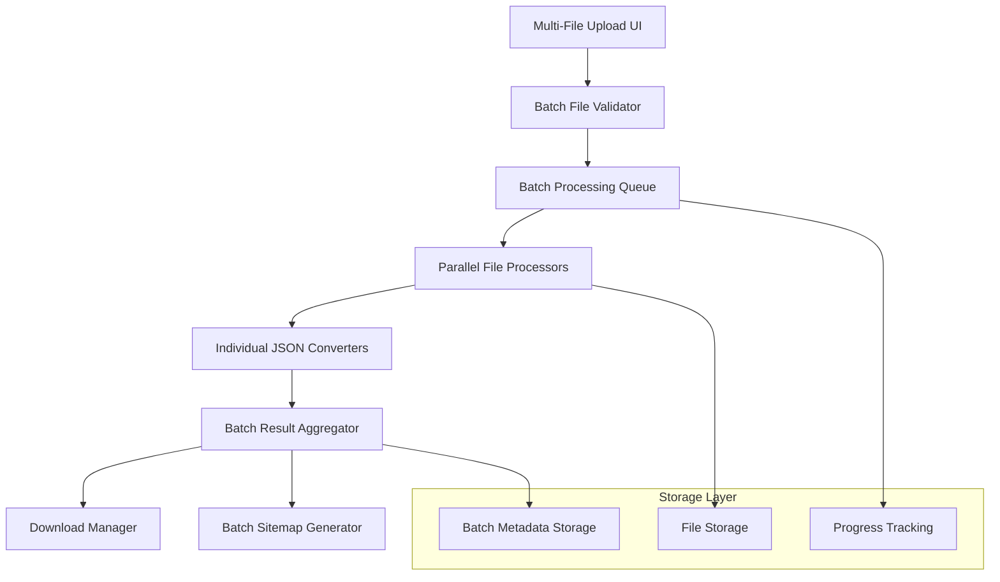
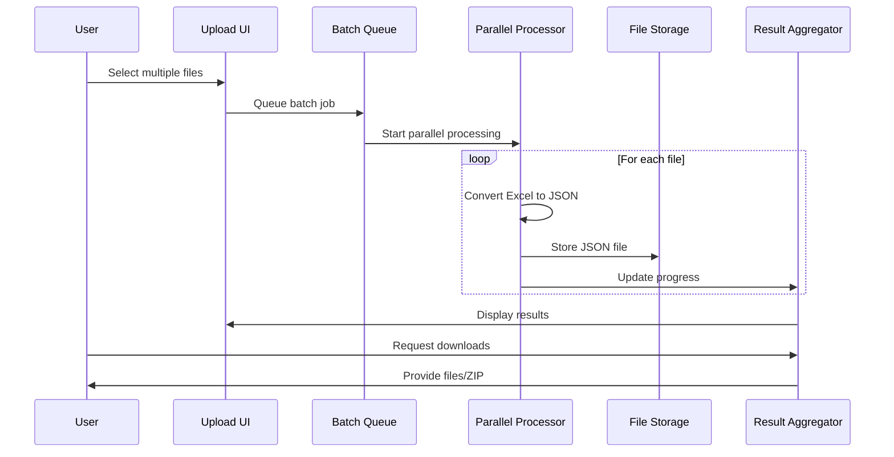

# Design Document

## Overview

The multi-file batch processing feature extends the existing sitemap generator to handle multiple Excel files simultaneously. The design focuses on maintaining the current user experience while adding batch capabilities through enhanced file upload, parallel processing, and batch result management.

## Architecture

### High-Level Architecture



### Processing Flow



## Components and Interfaces

### 1. Enhanced File Upload Component

**MultiFileUploadComponent**
- Extends existing FileUploadComponent
- Supports drag-and-drop for multiple files
- File validation and preview
- Progress tracking per file

```javascript
interface MultiFileUploadProps {
  onFilesUpload: (files: FileUploadResult[]) => void;
  maxFiles?: number;
  maxFileSize?: number;
  acceptedTypes?: string[];
}

interface FileUploadResult {
  fileId: string;
  fileName: string;
  fileSize: number;
  status: 'pending' | 'processing' | 'completed' | 'error';
  error?: string;
}
```

### 2. Batch Processing Manager

**BatchProcessingManager**
- Coordinates parallel file processing
- Manages processing queue
- Tracks progress and errors

```javascript
interface BatchJob {
  batchId: string;
  files: FileUploadResult[];
  config: ProcessingConfig;
  status: 'queued' | 'processing' | 'completed' | 'failed';
  progress: BatchProgress;
}

interface BatchProgress {
  totalFiles: number;
  completedFiles: number;
  failedFiles: number;
  currentFile?: string;
}
```

### 3. Batch Results Component

**BatchResultsComponent**
- Displays processing results
- Provides download options
- Shows error details and retry options

```javascript
interface BatchResult {
  batchId: string;
  results: FileProcessingResult[];
  summary: BatchSummary;
  downloadOptions: DownloadOption[];
}

interface FileProcessingResult {
  fileId: string;
  fileName: string;
  status: 'success' | 'error';
  jsonFileId?: string;
  error?: ProcessingError;
  statistics?: ConversionStatistics;
}
```

### 4. Download Manager

**BatchDownloadManager**
- Handles individual and batch downloads
- Creates ZIP archives for batch downloads
- Manages download URLs and cleanup

```javascript
interface DownloadManager {
  downloadSingleFile(fileId: string): Promise<DownloadResult>;
  downloadBatch(batchId: string): Promise<DownloadResult>;
  createZipArchive(files: FileReference[]): Promise<ZipResult>;
}
```

## Data Models

### Batch Processing Models

```javascript
// Batch job tracking
interface BatchJob {
  batchId: string;
  userId?: string;
  createdAt: Date;
  updatedAt: Date;
  status: BatchStatus;
  files: BatchFile[];
  config: BatchConfig;
  results?: BatchResults;
}

// Individual file in batch
interface BatchFile {
  fileId: string;
  originalName: string;
  size: number;
  status: FileStatus;
  processingStarted?: Date;
  processingCompleted?: Date;
  error?: ProcessingError;
  resultFileId?: string;
}

// Batch configuration
interface BatchConfig {
  columnMapping: ColumnMapping;
  urlPattern: string;
  environment: string;
  sitemapConfig?: SitemapConfig;
  processingOptions: ProcessingOptions;
}
```

### Storage Models

```javascript
// Enhanced file storage for batch processing
interface BatchFileStorage {
  batchId: string;
  files: Map<string, StoredFile>;
  metadata: BatchMetadata;
  createdAt: Date;
  expiresAt: Date;
}

// Individual stored file
interface StoredFile {
  fileId: string;
  originalName: string;
  storagePath: string;
  fileType: string;
  size: number;
  checksum: string;
}
```

## Error Handling

### Error Categories

1. **Upload Errors**
   - Invalid file format
   - File size exceeded
   - Too many files
   - Network errors

2. **Processing Errors**
   - Corrupted Excel files
   - Invalid data structure
   - Memory limitations
   - Timeout errors

3. **Storage Errors**
   - Disk space issues
   - Permission errors
   - File system errors

### Error Recovery

```javascript
interface ErrorRecovery {
  retryableErrors: string[];
  maxRetries: number;
  retryDelay: number;
  fallbackStrategies: Map<string, FallbackStrategy>;
}

interface FallbackStrategy {
  condition: (error: ProcessingError) => boolean;
  action: (file: BatchFile) => Promise<ProcessingResult>;
}
```

## Testing Strategy

### Unit Testing

1. **File Upload Validation**
   - Test file type validation
   - Test file size limits
   - Test multiple file handling

2. **Batch Processing Logic**
   - Test parallel processing
   - Test error handling
   - Test progress tracking

3. **Download Management**
   - Test individual downloads
   - Test ZIP creation
   - Test cleanup processes

### Integration Testing

1. **End-to-End Batch Flow**
   - Upload multiple files
   - Process batch
   - Download results

2. **Error Scenarios**
   - Mixed success/failure batches
   - Network interruptions
   - Storage limitations

3. **Performance Testing**
   - Large file batches
   - Concurrent batch processing
   - Memory usage optimization

### API Testing

1. **Batch Upload Endpoints**
   - Multi-file upload handling
   - Progress tracking APIs
   - Error response formats

2. **Download Endpoints**
   - Individual file downloads
   - Batch ZIP downloads
   - URL expiration handling

## Performance Considerations

### Parallel Processing

- Use Web Workers for client-side processing
- Implement server-side worker pools
- Limit concurrent processing to prevent resource exhaustion

### Memory Management

- Stream processing for large files
- Garbage collection optimization
- Temporary file cleanup

### Storage Optimization

- Compress JSON outputs
- Implement file deduplication
- Automatic cleanup of expired files

## Security Considerations

### File Upload Security

- Validate file signatures, not just extensions
- Implement virus scanning for uploaded files
- Limit upload rates to prevent abuse

### Access Control

- Generate secure, time-limited download URLs
- Implement batch ownership validation
- Audit logging for batch operations

### Data Privacy

- Automatic file expiration
- Secure deletion of temporary files
- No persistent storage of user data without consent