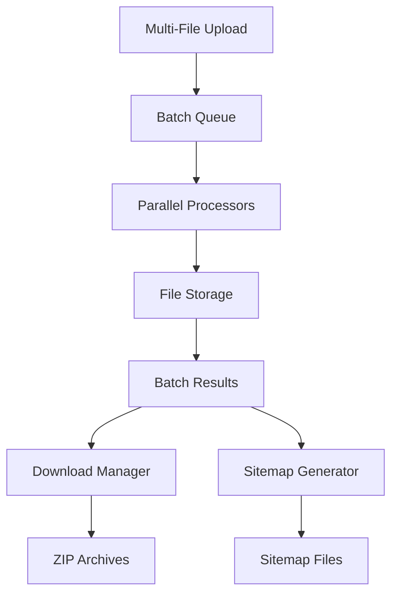

# Multi-File Batch Processing Feature

## Overview

The Multi-File Batch Processing feature extends the sitemap generator to handle multiple Excel/CSV files simultaneously, providing efficient batch conversion to JSON and sitemap generation capabilities.

## Features

### ✅ Completed Features

1. **Multi-File Upload**
   - Drag-and-drop interface for multiple files
   - File validation and progress tracking
   - Support for Excel (.xlsx, .xls) and CSV files
   - Configurable file limits and size restrictions

2. **Batch Processing Queue**
   - Parallel file processing with configurable concurrency
   - Real-time progress tracking and status updates
   - Error handling with retry mechanisms
   - Batch lifecycle management (pause, resume, cancel)

3. **Batch Results Management**
   - Comprehensive results dashboard
   - Individual file status and statistics
   - Bulk operations (download, retry)
   - Filtering and sorting capabilities

4. **Download Management**
   - Individual file downloads
   - Batch ZIP archive creation
   - Secure download URLs with expiration
   - Automatic cleanup of temporary files

5. **Batch Sitemap Generation**
   - Parallel sitemap creation from multiple JSON files
   - Configurable grouping and file splitting
   - ZIP archive creation for multiple sitemaps
   - Consistent configuration across all files

6. **API Endpoints**
   - RESTful API for batch operations
   - Progress tracking and status monitoring
   - Download management and file serving
   - Sitemap generation and retrieval

## Architecture

### Core Components

```
lib/
├── batchProcessing.js     # Data models and utilities
├── batchQueue.js          # Processing queue system
├── batchDownload.js       # Download management
├── batchSitemap.js        # Sitemap generation
├── batchInit.js           # System initialization
└── fileStorage.js         # Enhanced file storage

components/
├── MultiFileUploadComponent.jsx    # Multi-file upload UI
├── BatchResultsComponent.jsx       # Results dashboard
└── BatchProgressComponent.jsx      # Progress tracking

app/api/
├── batch-upload/          # File upload endpoint
├── batch-convert/         # Conversion endpoint
├── batch-status/          # Status monitoring
├── batch-download/        # Download management
├── batch-sitemap-generate/    # Sitemap generation
├── batch-sitemap-download/    # Sitemap downloads
└── batch-sitemap-status/      # Sitemap status
```

### Data Flow



## Usage

### 1. Basic Batch Processing

```javascript
// Upload multiple files
const formData = new FormData();
files.forEach(file => formData.append('files', file));
formData.append('config', JSON.stringify(config));

const response = await fetch('/api/batch-upload', {
  method: 'POST',
  body: formData
});

const result = await response.json();
// { success: true, batchId: "batch_123...", fileCount: 5 }
```

### 2. Monitor Progress

```javascript
// Get batch status
const response = await fetch(`/api/batch-status/${batchId}`);
const status = await response.json();

// {
//   batchId: "batch_123...",
//   status: "processing",
//   progress: {
//     totalFiles: 5,
//     completedFiles: 3,
//     failedFiles: 0,
//     processingFiles: 2
//   }
// }
```

### 3. Download Results

```javascript
// Download single file
const response = await fetch('/api/batch-download', {
  method: 'POST',
  headers: { 'Content-Type': 'application/json' },
  body: JSON.stringify({ batchId, fileId })
});

// Download entire batch as ZIP
const response = await fetch('/api/batch-download', {
  method: 'POST',
  headers: { 'Content-Type': 'application/json' },
  body: JSON.stringify({ batchId })
});
```

### 4. Generate Sitemaps

```javascript
// Generate sitemaps for batch
const response = await fetch('/api/batch-sitemap-generate', {
  method: 'POST',
  headers: { 'Content-Type': 'application/json' },
  body: JSON.stringify({
    batchId,
    sitemapConfig: {
      maxPerFile: 50000,
      grouping: 'auto',
      changefreq: 'weekly',
      priority: '0.8'
    }
  })
});
```

## Configuration

### Batch Configuration

```javascript
const batchConfig = {
  // Column mapping for all files
  columnMapping: {
    link: 'url',
    title: 'name',
    description: 'desc'
  },
  
  // URL pattern template
  urlPattern: 'https://example.com/{link}',
  
  // Environment selection
  environment: 'prod',
  
  // Processing options
  maxConcurrentFiles: 3,
  retryAttempts: 2,
  timeoutMs: 300000
};
```

### Sitemap Configuration

```javascript
const sitemapConfig = {
  maxPerFile: 50000,        // Max URLs per sitemap file
  grouping: 'auto',         // 'auto', 'none', or field name
  changefreq: 'weekly',     // Sitemap changefreq
  priority: '0.8',          // Default priority
  includeLastmod: false     // Include lastmod dates
};
```

## API Reference

### Batch Upload
- **POST** `/api/batch-upload`
- **Body**: FormData with files and config
- **Response**: `{ success: true, batchId: string, fileCount: number }`

### Batch Status
- **GET** `/api/batch-status/{batchId}`
- **Response**: Batch status and progress information

### Batch Control
- **POST** `/api/batch-status/{batchId}`
- **Body**: `{ action: 'cancel' | 'pause' | 'resume' }`
- **Response**: Updated batch status

### Batch Download
- **POST** `/api/batch-download`
- **Body**: `{ batchId: string, fileId?: string }`
- **Response**: Download token and file information

- **GET** `/api/batch-download?token={token}`
- **Response**: File download (JSON or ZIP)

### Sitemap Generation
- **POST** `/api/batch-sitemap-generate`
- **Body**: `{ batchId: string, sitemapConfig: object }`
- **Response**: Generation results and job ID

### Sitemap Download
- **POST** `/api/batch-sitemap-download`
- **Body**: `{ jobId: string, fileName?: string }`
- **Response**: Download token for sitemap files

## Error Handling

### Error Categories

1. **Upload Errors**
   - Invalid file format
   - File size exceeded
   - Too many files

2. **Processing Errors**
   - Corrupted files
   - Invalid data structure
   - Memory limitations

3. **Storage Errors**
   - Disk space issues
   - Permission errors
   - File system errors

### Retry Mechanism

- Automatic retry for retryable errors
- Configurable retry attempts and delays
- Exponential backoff for network errors
- Manual retry options in UI

## Performance Considerations

### Concurrency Limits
- Default: 3 concurrent files
- Configurable per batch
- Prevents resource exhaustion

### Memory Management
- Stream processing for large files
- Automatic garbage collection
- Temporary file cleanup

### Storage Optimization
- Compressed JSON outputs
- Automatic file expiration
- Batch directory organization

## Security Features

### File Validation
- File signature verification
- Size and type restrictions
- Malicious content detection

### Access Control
- Secure download URLs
- Time-limited tokens
- Batch ownership validation

### Data Privacy
- Automatic file expiration
- Secure deletion
- No persistent user data storage

## Monitoring and Logging

### Progress Tracking
- Real-time status updates
- Detailed error reporting
- Performance metrics

### Audit Logging
- Batch operation logs
- Error categorization
- Performance monitoring

## Deployment Notes

### Environment Variables
```bash
# Optional configuration
BATCH_MAX_FILES=20
BATCH_MAX_FILE_SIZE=52428800  # 50MB
BATCH_CLEANUP_INTERVAL=3600000  # 1 hour
```

### System Requirements
- Node.js 18+
- Sufficient disk space for temporary files
- Memory for concurrent processing

### Scaling Considerations
- Horizontal scaling with shared storage
- Load balancing for API endpoints
- Database for persistent batch metadata

## Future Enhancements

### Planned Features
- Database persistence for batch metadata
- WebSocket real-time updates
- Advanced error recovery
- Performance analytics dashboard
- User authentication and authorization

### Potential Improvements
- Cloud storage integration
- Distributed processing
- Advanced file validation
- Custom processing pipelines

## Troubleshooting

### Common Issues

1. **Upload Failures**
   - Check file size limits
   - Verify file formats
   - Ensure sufficient disk space

2. **Processing Errors**
   - Review file content structure
   - Check column mapping configuration
   - Verify URL pattern syntax

3. **Download Issues**
   - Check token expiration
   - Verify file existence
   - Ensure proper permissions

### Debug Mode
Enable detailed logging by setting environment variable:
```bash
DEBUG=batch:*
```

## Support

For issues and questions:
1. Check the troubleshooting section
2. Review API documentation
3. Check system logs for detailed error information
4. Verify configuration settings